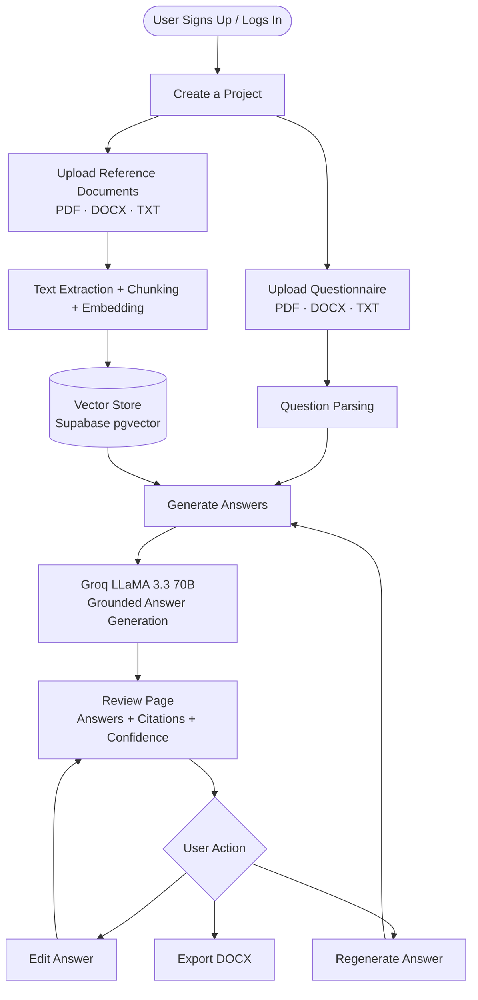
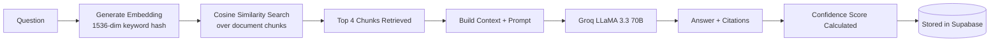

# AnswerFlow AI

> Built for the GTM Engineering Internship assignment — a tool that automates answering structured questionnaires using internal reference documents and AI.

🔗 **Live App:** https://answerflow-ai-rsut.vercel.app
📦 **GitHub:** https://github.com/asthasingh0660/answerflow-ai
📁 **Sample Data (to test the app):** https://drive.google.com/drive/folders/1Dd_V1-eAHk9OKVkWTskoqaJR_DwaYC89?usp=sharing

---

## What I Built

AnswerFlow AI lets you upload your internal documents and a questionnaire, and the AI automatically answers each question by retrieving relevant information from your documents — with citations, confidence scores, and the ability to edit or regenerate any answer before exporting.

The full flow:



---

## The Fictional Company

**Industry:** B2B SaaS Analytics

**Company: CloudPulse**
CloudPulse is a SaaS analytics platform that helps product and growth teams track user behavior, measure feature adoption, and monitor engagement across web and mobile apps. It serves 500+ mid-market and enterprise customers in fintech, e-commerce, and edtech.

I created a realistic vendor security questionnaire (15 questions) and 4 reference documents covering CloudPulse's security policy, data retention policy, infrastructure overview, and access control policy. These are available in the sample data folder linked above.

---

## Features

**Phase 1 — Core Workflow**
- Email/password auth + Google OAuth
- Project workspaces to keep things organized
- Upload reference docs and questionnaires (PDF, DOCX, TXT, XLSX)
- RAG pipeline: chunk → embed → retrieve → generate answers
- Citations attached to every answer
- Returns `"Not found in references."` when the answer isn't supported by the docs

**Phase 2 — Review & Export**
- Full review UI showing questions, answers, and citations
- Edit any answer inline before exporting
- Export to DOCX — preserves original question order, inserts answers below each question, includes citations

**Nice-to-Have (implemented all of them)**
- Confidence score per answer (based on retrieval similarity)
- Evidence snippets — expandable chunks showing exactly which text was used
- Partial regeneration — regenerate a single answer without re-running everything
- Version history — every run is saved with timestamps and coverage stats
- Coverage summary — total / answered / not found with a progress bar

---

## How the RAG Pipeline Works



The embedding approach uses a deterministic keyword-hash rather than a neural model — this was a deliberate trade-off for the demo (no extra API, no latency). In a real system I'd swap this for `text-embedding-3-small` from OpenAI, which is a one-line change in `lib/groq.ts`.

The LLM prompt is strict: *"Answer ONLY based on the reference context. If not found, return: Not found in references."* This prevents hallucinations and keeps answers grounded.

---

## Tech Stack

| Layer | What I Used | Why |
|---|---|---|
| Framework | Next.js 14 (App Router) | Full-stack in one repo, easy Vercel deploy |
| Auth | Supabase Auth | Email + Google OAuth done fast |
| Database | Supabase Postgres + pgvector | Vector search without running a separate service |
| File Storage | Supabase Storage | Already in the ecosystem |
| LLM | Groq LLaMA 3.3 70B | Free, fast, good quality |
| Embeddings | Deterministic keyword-hash | No external API needed for demo |
| Export | docx npm package | Generates proper Word documents |
| Deployment | Vercel | Zero-config for Next.js |

---

## Assumptions I Made

1. **Embeddings** — Groq doesn't have an embeddings endpoint, so I built a deterministic keyword-hash embedding. It works well enough for a focused document set. For production, I'd use a proper neural embedding model.

2. **Question parsing** — The parser detects numbered lines (`1.`, `Q1:`, `1)`) and lines ending with `?`. Works for standard questionnaire formats. Complex table-based or nested formats would need an LLM parsing step.

3. **One questionnaire per run** — The system always uses the most recently uploaded questionnaire. A selector UI would be needed for managing multiple questionnaires.

4. **File size** — I cap text extraction at 50,000 characters per document to avoid API timeouts. This comfortably handles most documents up to ~50 pages.

---

## Trade-offs

| Decision | What I traded off |
|---|---|
| pgvector instead of ChromaDB | Slightly less optimized for pure vector workloads, but no separate deployment to manage |
| Keyword-hash embeddings | Lower semantic accuracy than neural embeddings, but zero external API dependency |
| Next.js API routes instead of FastAPI | Less control over async processing, but single deployment and much faster to build |
| SSE streaming for processing | Good real-time UX, but a proper job queue (like Inngest) would be more reliable at scale |

---

## What I'd Improve With More Time

- Replace keyword-hash with a proper neural embedding model (`text-embedding-3-small`)
- Move RAG processing to a background job queue (Inngest or BullMQ) for better reliability
- Add PDF export option alongside DOCX
- Smarter question parsing using an LLM for complex/nested questionnaire formats
- Team collaboration — shared projects, comments on answers
- Hallucination detection — verify that answer claims actually exist in the retrieved chunks
- Better chunking strategy — experiment with different chunk sizes per document type

---

## Running Locally

```bash
git clone https://github.com/asthasingh0660/answerflow-ai
cd answerflow-ai
npm install
cp .env.local.example .env.local
# Fill in your Supabase and Groq keys
npm run dev
```

**Environment variables needed:**
```
NEXT_PUBLIC_SUPABASE_URL=
NEXT_PUBLIC_SUPABASE_ANON_KEY=
SUPABASE_SERVICE_ROLE_KEY=
GROQ_API_KEY=
```

**Supabase setup:**
1. Run `supabase-schema.sql` in the SQL editor
2. Create a storage bucket named `documents` (private)
3. Enable Google OAuth under Authentication → Providers

---

## Testing the App

The sample data folder has everything you need:
📁 https://drive.google.com/drive/folders/1Dd_V1-eAHk9OKVkWTskoqaJR_DwaYC89?usp=sharing

1. Sign up at https://answerflow-ai-rsut.vercel.app
2. Create a new project
3. Upload `01-security-policy.txt`, `02-data-retention-policy.txt`, `03-infrastructure-and-compliance.txt`, and `04-access-control-policy.txt` as **Reference Documents**
4. Upload `questionnaire.txt` as the **Questionnaire**
5. Click **Generate Answers** and watch the progress bar
6. Review answers, try editing or regenerating one
7. Export as DOCX